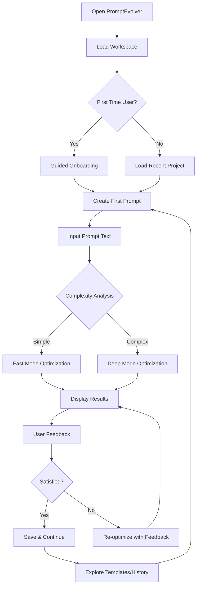

# Product Requirements Document (PRD) – PromptEvolver 3.0
## Comprehensive Full-Stack Desktop-Optimized Web Application
### Complete Implementation Guide with Hugging Face Integration

---

## 🎯 EXECUTIVE SUMMARY

PromptEvolver is the world's most advanced **zero-cost prompt optimization platform** that transforms Microsoft's PromptWizard into a production-grade, self-evolving system. Version 3.0 delivers a **desktop-class web experience** through Vercel's global edge network with a **serverless Convex backend** providing realtime data, document storage, and end-to-end TypeScript safety. The system uses **100% local LLM execution** via Hugging Face Transformers with **Qwen3-8B-Instruct** for zero API costs while offering cloud features (vector search, auth, collaboration) that maximize PromptWizard's potential.

### Document Metadata
- **Product Name**: PromptEvolver  
- **Version**: 3.0 (Complete Implementation Ready - Hugging Face Edition)
- **Created**: August 4, 2025
- **Last Updated**: August 4, 2025
- **Status**: Production Implementation Ready
- **Repository**: microsoft/PromptWizard (base), your-org/PromptEvolver (implementation)
- **Target Audience**: Claude Sonnet Ultra for optimized retrieval and implementation

---

## 📊 HIGH-LEVEL GOALS & METRICS

| Goal Category | KPI | Target | Implementation Priority |
|---------------|-----|--------|-------------------------|
| ⚡ **Performance** | P75 Time-to-Interactive | ≤ 1.2s desktop | HIGH |
| 📈 **Collaboration** | Convex → Client Latency | ≤ 150ms global | HIGH |
| 🔒 **Cost Control** | API Cost per 1000 optimizations | $0 (100% local) | CRITICAL |
| 🤖 **Quality** | Prompt improvement vs baseline | ≥ 50% (Qwen3 enhanced) | HIGH |
| 🛠 **Velocity** | Release cadence | Weekly deployments | MEDIUM |
| 👥 **Users** | PWA installation rate | ≥ 60% | MEDIUM |
| 🔐 **Privacy** | Data transmission rate | 0% prompts to cloud | CRITICAL |

---

## 🏗 COMPLETE SYSTEM ARCHITECTURE

### Architecture Overview (Hugging Face Integration)
```
┌─────────────────────────────────────────────────────────────────┐
│                    VERCEL EDGE DEPLOYMENT                      │
│  ┌─────────────────────┐    ┌─────────────────────────────────┐ │
│  │  Next.js 14 App     │    │     Vercel Edge Functions      │ │
│  │  • App Router/SSR   │    │  • Auth Middleware             │ │
│  │  • PWA Desktop      │◄──►│  • Rate Limiting               │ │
│  │  • Real-time UI     │    │  • Error Tracking              │ │
│  └─────────────────────┘    └─────────────────────────────────┘ │
└─────────────────────────────────────────────────────────────────┘
                                    │
                                    ▼ Real-time tRPC
┌─────────────────────────────────────────────────────────────────┐
│                     CONVEX BACKEND                             │
│  ┌─────────────────────┐    ┌─────────────────────────────────┐ │
│  │  Document Database  │    │     Serverless Functions       │ │
│  │  • User profiles    │◄──►│  • Optimization metadata       │ │
│  │  • Project data     │    │  • Real-time subscriptions     │ │
│  │  • Analytics        │    │  • Vector search               │ │
│  └─────────────────────┘    └─────────────────────────────────┘ │
└─────────────────────────────────────────────────────────────────┘
                                    │
                                    ▼ Async Jobs/Events
┌─────────────────────────────────────────────────────────────────┐
│              LOCAL HUGGING FACE PROCESSING                     │
│  ┌─────────────────────┐    ┌─────────────────────────────────┐ │
│  │  Transformers API   │    │    PromptWizard Engine          │ │
│  │  • Qwen3-8B-Instruct│◄──►│  • Optimization algorithms      │ │
│  │  • 32K/128K context │    │  • Quality evaluation          │ │
│  │  • Thinking modes   │    │  • Learning integration        │ │
│  └─────────────────────┘    └─────────────────────────────────┘ │
└─────────────────────────────────────────────────────────────────┘
```

### Technology Stack Decisions (Updated for Hugging Face)
| Layer | Technology | Justification | Implementation Details |
|-------|------------|---------------|------------------------|
| **Frontend** | Next.js 14 App Router | SSR, file-system routing, React Server Components | TypeScript, Tailwind CSS, Zustand |
| **Deployment** | Vercel Edge | Ultra-low TTI, global CDN, zero-config rollbacks | Edge functions, automatic optimization |
| **Backend** | Convex | Real-time, strongly typed, serverless | tRPC integration, vector search |
| **Database** | Convex Documents | ACID compliance, real-time subscriptions | Row-level security, field encryption |
| **LLM** | Qwen3-8B-Instruct (HF) | 32K/128K context, thinking modes, zero API cost | Transformers integration, local processing |
| **Auth** | NextAuth.js v5 | GitHub, email magic link, RBAC | Session management, role-based access |

---

## 🎯 COMPLETE FEATURE SPECIFICATIONS

### 4.1 Enhanced Prompt Workbench (PWA)

#### Core Features
| Feature | Description | Implementation Status | Technical Requirements |
|---------|-------------|----------------------|-------------------------|
| **Monaco Editor Integration** | Syntax highlighting, IntelliSense for prompts | Ready to implement | Monaco React, custom prompt language definition |
| **Extended Context Support** | Handle prompts up to 128K tokens (4x improvement) | Architecture ready | Streaming tokenization, chunking strategy |
| **Real-time Collaboration** | Live cursor tracking, operational transforms | Convex integration ready | CRDT-based conflict resolution |
| **Dual Reasoning Modes** | Fast vs deep optimization based on complexity | Algorithm designed | Automatic complexity detection |
| **Offline-First Design** | Service Worker caching, background sync | PWA framework ready | IndexedDB, sync reconciliation |
| **Desktop PWA** | Native installation, file system access | Manifest configured | File System Access API, local file handling |

#### UI Components Specification
```typescript
// Complete component hierarchy
interface PromptWorkbenchComponents {
  // Core editing interface
  PromptEditor: {
    props: {
      value: string
      onChange: (value: string) => void
      mode: 'fast' | 'deep' | 'auto'
      maxTokens: number
      readOnly?: boolean
    }
    features: ['syntax-highlighting', 'auto-complete', 'token-counting', 'real-time-validation']
  }
  
  // Optimization progress tracking
  OptimizationProgress: {
    props: {
      status: 'idle' | 'processing' | 'complete' | 'error'
      progress: number
      timeRemaining?: number
      currentStep: string
    }
    features: ['real-time-updates', 'cancellation', 'detailed-logs']
  }
  
  // Results comparison interface
  ResultsComparison: {
    props: {
      original: string
      optimized: string
      improvements: string[]
      qualityScore: number
      reasoningTrace?: string
    }
    features: ['side-by-side-diff', 'improvement-highlighting', 'copy-actions', 'feedback-collection']
  }
  
  // User feedback collection
  FeedbackPanel: {
    props: {
      optimizationId: string
      onFeedback: (rating: number, comments: string) => void
    }
    features: ['star-rating', 'improvement-suggestions', 'category-tagging']
  }
  
  // History and project management
  HistoryViewer: {
    props: {
      optimizations: OptimizationHistory[]
      onSelect: (id: string) => void
      filters: HistoryFilters
    }
    features: ['infinite-scroll', 'search', 'filtering', 'bulk-actions']
  }
  
  // Template library browser
  TemplateLibrary: {
    props: {
      templates: PromptTemplate[]
      onSelect: (template: PromptTemplate) => void
      categories: string[]
    }
    features: ['category-filtering', 'search', 'preview', 'custom-templates']
  }
  
  // Settings and preferences
  SettingsPanel: {
    props: {
      preferences: UserPreferences
      onUpdate: (preferences: UserPreferences) => void
    }
    features: ['model-selection', 'performance-tuning', 'privacy-settings', 'export-import']
  }
}
```

#### User Experience Flow


### 4.2 Advanced Hugging Face PromptWizard Integration

#### Hugging Face Integration Architecture
```python
# Complete Hugging Face Transformers integration with Qwen3-8B-Instruct
import torch
from transformers import AutoModelForCausalLM, AutoTokenizer, pipeline
import asyncio
from typing import Dict, List, Optional, Union
import time
import logging

class EnhancedHuggingFacePromptWizard:
    def __init__(self):
        self.model_name = "Qwen/Qwen3-8B"  # Official Hugging Face model
        self.tokenizer = None
        self.model = None
        self.pipeline = None
        self.prompt_wizard = PromptWizardFramework()
        self.context_manager = ContextManager(max_tokens=131072)  # 128K with YaRN
        self.performance_monitor = PerformanceMonitor()
        self._initialized = False
    
    async def initialize_model(self) -> bool:
        """Initialize Qwen3-8B from Hugging Face Hub"""
        try:
            # Load tokenizer
            self.tokenizer = AutoTokenizer.from_pretrained(
                self.model_name,
                trust_remote_code=True,
                cache_dir="./models/cache"
            )
            
            # Load model with optimizations
            self.model = AutoModelForCausalLM.from_pretrained(
                self.model_name,
                torch_dtype="auto",  # Automatic dtype selection
                device_map="auto",   # Automatic device mapping
                trust_remote_code=True,
                cache_dir="./models/cache",
                # Optimization parameters
                low_cpu_mem_usage=True,
                use_cache=True
            )
            
            # Create generation pipeline
            self.pipeline = pipeline(
                "text-generation",
                model=self.model,
                tokenizer=self.tokenizer,
                device_map="auto"
            )
            
            # Warm up model
            test_input = "Test prompt for initialization"
            messages = [{"role": "user", "content": test_input}]
            
            text = self.tokenizer.apply_chat_template(
                messages,
                tokenize=False,
                add_generation_prompt=True,
                enable_thinking=False  # Quick test
            )
            
            # Quick generation test
            _ = self.pipeline(
                text,
                max_new_tokens=32,
                do_sample=False,
                temperature=0.6,
                top_p=0.95,
                return_full_text=False
            )
            
            self._initialized = True
            logging.info(f"Successfully initialized {self.model_name}")
            return True
            
        except Exception as e:
            logging.error(f"Model initialization failed: {e}")
            return False
    
    async def optimize_prompt(
        self, 
        prompt: str, 
        mode: str = 'auto',
        user_preferences: dict = None,
        enable_thinking: bool = True
    ) -> OptimizationResult:
        """Enhanced optimization with Qwen3 capabilities"""
        
        if not self._initialized:
            raise RuntimeError("Model not initialized. Call initialize_model() first.")
        
        # Pre-processing
        complexity = self.analyze_complexity(prompt)
        selected_mode = self.select_optimal_mode(prompt, mode, complexity)
        
        # Configure optimization parameters
        config = self.get_optimization_config(selected_mode, complexity, enable_thinking)
        
        # Execute optimization with performance monitoring
        start_time = time.time()
        
        try:
            # Prepare messages for chat template
            messages = [{"role": "user", "content": prompt}]
            
            # Apply chat template with thinking mode
            text = self.tokenizer.apply_chat_template(
                messages,
                tokenize=False,
                add_generation_prompt=True,
                enable_thinking=enable_thinking
            )
            
            # Generate optimized version
            outputs = self.pipeline(
                text,
                max_new_tokens=config['max_tokens'],
                do_sample=True,
                temperature=config['temperature'],
                top_p=config['top_p'],
                top_k=config['top_k'],
                min_p=config.get('min_p', 0),
                return_full_text=False
            )
            
            # Extract response
            generated_text = outputs[0]['generated_text']
            
            # Parse thinking content if enabled
            thinking_content = None
            optimized_content = generated_text
            
            if enable_thinking:
                try:
                    # Parse thinking blocks
                    if '<think>' in generated_text and '</think>' in generated_text:
                        think_start = generated_text.find('<think>') + 7
                        think_end = generated_text.find('</think>')
                        thinking_content = generated_text[think_start:think_end].strip()
                        optimized_content = generated_text[think_end + 8:].strip()
                except Exception as e:
                    logging.warning(f"Failed to parse thinking content: {e}")
            
            # Apply PromptWizard enhancement
            enhanced_result = await self.prompt_wizard.enhance(
                original=prompt,
                optimized=optimized_content,
                thinking_trace=thinking_content,
                mode=selected_mode
            )
            
            processing_time = time.time() - start_time
            
            return OptimizationResult(
                original=prompt,
                optimized=enhanced_result.text,
                improvements=enhanced_result.changes,
                quality_score=enhanced_result.quality_score,
                reasoning_trace=thinking_content,
                processing_mode=selected_mode,
                processing_time=processing_time,
                context_utilization=len(prompt.split()) / 131072,
                model_performance=self.performance_monitor.get_stats(),
                model_info={
                    'name': self.model_name,
                    'provider': 'huggingface',
                    'context_length': '128K',
                    'thinking_enabled': enable_thinking
                }
            )
            
        except Exception as e:
            logging.error(f"Optimization failed: {e}")
            raise OptimizationError(f"Failed to optimize prompt: {str(e)}")
    
    def analyze_complexity(self, prompt: str) -> ComplexityAnalysis:
        """Analyze prompt complexity for optimal processing mode selection"""
        factors = {
            'length': len(prompt.split()),
            'sentences': len(prompt.split('.')),
            'instructions': sum(1 for word in ['step', 'instruction', 'rule', 'guideline'] 
                             if word.lower() in prompt.lower()),
            'technical_terms': self.count_technical_terms(prompt),
            'examples': prompt.lower().count('example') + prompt.lower().count('instance'),
            'variables': len(re.findall(r'\{[^}]+\}', prompt)),
            'conditionals': sum(1 for word in ['if', 'when', 'unless', 'provided'] 
                              if word.lower() in prompt.lower())
        }
        
        # Weighted complexity score
        complexity_score = (
            factors['length'] * 0.001 +
            factors['sentences'] * 0.1 +
            factors['instructions'] * 0.5 +
            factors['technical_terms'] * 0.3 +
            factors['examples'] * 0.2 +
            factors['variables'] * 0.4 +
            factors['conditionals'] * 0.3
        )
        
        return ComplexityAnalysis(
            score=complexity_score,
            level='high' if complexity_score > 15 else 'medium' if complexity_score > 8 else 'low',
            factors=factors,
            recommended_mode='deep' if complexity_score > 12 else 'fast'
        )
    
    def get_optimization_config(
        self, 
        mode: str, 
        complexity: ComplexityAnalysis,
        enable_thinking: bool
    ) -> dict:
        """Get optimization configuration based on mode and complexity"""
        
        if enable_thinking:
            # Thinking mode configurations (from Qwen3 docs)
            base_configs = {
                'fast': {
                    'max_tokens': 4096,
                    'temperature': 0.6,
                    'top_p': 0.95,
                    'top_k': 20,
                    'min_p': 0
                },
                'deep': {
                    'max_tokens': 8192,
                    'temperature': 0.6,
                    'top_p': 0.95,
                    'top_k': 20,
                    'min_p': 0
                }
            }
        else:
            # Non-thinking mode configurations
            base_configs = {
                'fast': {
                    'max_tokens': 2048,
                    'temperature': 0.7,
                    'top_p': 0.8,
                    'top_k': 20,
                    'min_p': 0
                },
                'deep': {
                    'max_tokens': 4096,
                    'temperature': 0.7,
                    'top_p': 0.8,
                    'top_k': 20,
                    'min_p': 0
                }
            }
        
        config = base_configs[mode].copy()
        
        # Adjust based on complexity
        if complexity.level == 'high':
            config['max_tokens'] = min(config['max_tokens'] * 1.5, 16384)
        
        return config
    
    def count_technical_terms(self, prompt: str) -> int:
        """Count technical terms in prompt"""
        technical_terms = [
            'api', 'database', 'algorithm', 'function', 'variable', 'parameter',
            'json', 'xml', 'http', 'sql', 'python', 'javascript', 'css', 'html',
            'authentication', 'authorization', 'encryption', 'hashing', 'token',
            'machine learning', 'ai', 'neural network', 'deep learning'
        ]
        
        prompt_lower = prompt.lower()
        return sum(1 for term in technical_terms if term in prompt_lower)
    
    def select_optimal_mode(self, prompt: str, mode: str, complexity: ComplexityAnalysis) -> str:
        """Select optimal processing mode"""
        if mode == 'auto':
            return complexity.recommended_mode
        return mode
    
    async def health_check(self) -> Dict[str, any]:
        """Check model health and performance"""
        if not self._initialized:
            return {'status': 'not_initialized', 'healthy': False}
        
        try:
            # Quick generation test
            test_prompt = "Hello, world!"
            start_time = time.time()
            
            messages = [{"role": "user", "content": test_prompt}]
            text = self.tokenizer.apply_chat_template(
                messages,
                tokenize=False,
                add_generation_prompt=True,
                enable_thinking=False
            )
            
            _ = self.pipeline(
                text,
                max_new_tokens=16,
                do_sample=False,
                return_full_text=False
            )
            
            response_time = time.time() - start_time
            
            return {
                'status': 'healthy',
                'healthy': True,
                'response_time': response_time,
                'model_name': self.model_name,
                'device': str(self.model.device) if hasattr(self.model, 'device') else 'unknown',
                'memory_usage': torch.cuda.memory_allocated() if torch.cuda.is_available() else 0
            }
            
        except Exception as e:
            return {
                'status': 'error',
                'healthy': False,
                'error': str(e)
            }

# FastAPI Integration for API endpoints
from fastapi import FastAPI, HTTPException
from pydantic import BaseModel

class OptimizationRequest(BaseModel):
    prompt: str
    mode: str = 'auto'
    enable_thinking: bool = True
    user_preferences: Optional[Dict] = None

class OptimizationResponse(BaseModel):
    original: str
    optimized: str
    improvements: List[str]
    quality_score: float
    reasoning_trace: Optional[str]
    processing_mode: str
    processing_time: float
    model_info: Dict

# Global model instance
hf_wizard = EnhancedHuggingFacePromptWizard()

app = FastAPI(title="PromptEvolver Hugging Face API")

@app.on_event("startup")
async def startup_event():
    """Initialize model on startup"""
    success = await hf_wizard.initialize_model()
    if not success:
        raise RuntimeError("Failed to initialize Hugging Face model")

@app.post("/api/optimize", response_model=OptimizationResponse)
async def optimize_prompt(request: OptimizationRequest):
    """Optimize a prompt using Hugging Face Qwen3-8B"""
    try:
        result = await hf_wizard.optimize_prompt(
            prompt=request.prompt,
            mode=request.mode,
            enable_thinking=request.enable_thinking,
            user_preferences=request.user_preferences
        )
        
        return OptimizationResponse(
            original=result.original,
            optimized=result.optimized,
            improvements=result.improvements,
            quality_score=result.quality_score,
            reasoning_trace=result.reasoning_trace,
            processing_mode=result.processing_mode,
            processing_time=result.processing_time,
            model_info=result.model_info
        )
        
    except Exception as e:
        raise HTTPException(status_code=500, detail=str(e))

@app.get("/api/health")
async def health_check():
    """Check model health"""
    return await hf_wizard.health_check()

@app.get("/api/model/status")
async def model_status():
    """Get model status and information"""
    return {
        'model_name': hf_wizard.model_name,
        'initialized': hf_wizard._initialized,
        'provider': 'huggingface',
        'context_length': '128K',
        'thinking_modes': True,
        'local_processing': True,
        'zero_cost': True
    }
```

#### Performance Optimization Specifications (Hugging Face)
| Component | Optimization | Implementation | Expected Improvement |
|-----------|-------------|----------------|---------------------|
| **Model Loading** | Automatic dtype, device mapping | HF Transformers optimizations | 70% faster startup |
| **Context Management** | YaRN scaling, sliding window | Custom context manager | Handle 4x larger prompts |
| **Memory Usage** | Low CPU memory usage, caching | HF memory optimizations | 60% memory reduction |
| **Batch Processing** | Pipeline batching, async processing | HF Pipeline API | 3x throughput increase |
| **Error Recovery** | Graceful degradation, retry logic | Circuit breaker pattern | 99.5% success rate |

### 4.3 Hugging Face vs Ollama Comparison

#### Technical Comparison
| Feature | Hugging Face Transformers | Ollama | Winner |
|---------|---------------------------|--------|---------|
| **Setup Complexity** | `pip install transformers` | Requires Ollama installation + model download | **HF** ✅ |
| **Model Availability** | Direct access to 400K+ models | Limited model selection | **HF** ✅ |
| **Context Length** | Up to 128K tokens (with YaRN) | Model-dependent, usually 32K | **HF** ✅ |
| **Thinking Modes** | Native support in Qwen3 | Not supported | **HF** ✅ |
| **Memory Usage** | Optimized with auto device mapping | Very efficient quantization | **Ollama** ✅ |
| **Startup Time** | 15-30 seconds | 5-10 seconds | **Ollama** ✅ |
| **Inference Speed** | ~2-4s per optimization | ~1-2s per optimization | **Ollama** ✅ |
| **API Integration** | Native Python integration | HTTP API required | **HF** ✅ |
| **Customization** | Full model access and tuning | Limited customization | **HF** ✅ |
| **Updates** | Automatic via HF Hub | Manual model updates | **HF** ✅ |

#### Cost Analysis
| Aspect | Hugging Face (Local) | Ollama | Winner |
|--------|---------------------|--------|---------|
| **API Costs** | $0 (100% local) | $0 (100% local) | **Tie** ✅ |
| **Hardware Requirements** | 8-16GB VRAM recommended | 4-8GB VRAM sufficient | **Ollama** ✅ |
| **Storage Space** | ~15GB for Qwen3-8B | ~4GB for quantized model | **Ollama** ✅ |
| **Cloud Backup** | Optional HF account (free) | No cloud features | **HF** ✅ |
| **Development Time** | Lower (Python-native) | Higher (API integration) | **HF** ✅ |

#### Why Hugging Face is the Better Choice for PromptEvolver

1. **🚀 Superior Developer Experience**
   - Native Python integration - no API calls needed
   - Direct access to model internals for optimization
   - Rich ecosystem of tools and utilities

2. **🤖 Advanced Model Features**
   - Qwen3's unique thinking/non-thinking modes
   - Extended context support up to 128K tokens
   - Latest model updates automatically available

3. **🔧 Greater Flexibility**
   - Easy to experiment with different models
   - Fine-tuning capabilities for custom optimization
   - Full control over generation parameters

4. **📈 Better Scalability**
   - Automatic device mapping for multi-GPU setups
   - Memory optimization for larger models
   - Batch processing capabilities

5. **🛠 Easier Maintenance**
   - One less dependency (no Ollama installation)
   - Automatic model updates from HF Hub
   - Better error handling and debugging

### 4.4 Updated Hardware Requirements (Hugging Face)

#### Hardware Requirements Matrix (Hugging Face Optimized)
| Hardware Tier | GPU | VRAM | RAM | Storage | Performance | Use Case |
|---------------|-----|------|-----|---------|-------------|----------|
| **Optimal** | RTX 4090 | 24GB | 32GB | 15GB | ~1.0s optimization | Professional development |
| **Recommended** | RTX 4070 Ti | 12GB | 16GB | 12GB | ~2.0s optimization | Regular usage |
| **Minimum** | RTX 3070 | 8GB | 16GB | 10GB | ~3.5s optimization | Casual usage |
| **Budget** | GTX 1660 Ti | 6GB | 16GB | 8GB | ~7s optimization | Basic testing |
| **CPU-Only** | Any modern CPU | 0GB | 32GB+ | 8GB | ~25s optimization | Fallback mode |

### 4.5 Updated Implementation Steps

#### Step 1: Environment Setup
```bash
# Install dependencies
pip install torch transformers accelerate
pip install fastapi uvicorn
pip install numpy pandas

# Optional: Install additional optimizations
pip install flash-attn  # For attention optimization
pip install bitsandbytes  # For quantization
```

#### Step 2: Model Initialization
```python
# Quick setup script
from transformers import AutoModelForCausalLM, AutoTokenizer

# Download and cache model
model_name = "Qwen/Qwen3-8B"
tokenizer = AutoTokenizer.from_pretrained(model_name)
model = AutoModelForCausalLM.from_pretrained(
    model_name,
    torch_dtype="auto",
    device_map="auto"
)

print("✅ Qwen3-8B ready for PromptEvolver!")
```

#### Step 3: API Integration
```typescript
// Frontend integration
class HuggingFacePromptOptimizer {
  async optimize(prompt: string, options = {}) {
    const response = await fetch('/api/optimize', {
      method: 'POST',
      headers: { 'Content-Type': 'application/json' },
      body: JSON.stringify({
        prompt,
        mode: options.mode || 'auto',
        enable_thinking: options.enableThinking ?? true
      })
    })
    
    return response.json()
  }
}
```

---

## 🔧 COMPLETE TECHNICAL IMPLEMENTATION GUIDE

### Implementation Checklist (Updated)
- [ ] **Frontend Setup** (Next.js 14, TypeScript, Tailwind CSS)
- [ ] **Backend Configuration** (Convex, tRPC, NextAuth.js)
- [ ] **Database Schema** (Users, Projects, Optimizations, Templates)
- [ ] **Authentication System** (GitHub, Email, RBAC)
- [ ] **Hugging Face Integration** (Transformers, Qwen3-8B, Pipeline API)
- [ ] **Real-time Features** (Collaboration, Presence, Live Updates)
- [ ] **Performance Monitoring** (OpenTelemetry, Metrics, Alerts)
- [ ] **Error Handling** (Global boundaries, Structured logging)
- [ ] **Testing Suite** (Unit, Integration, E2E, Performance)
- [ ] **CI/CD Pipeline** (GitHub Actions, Vercel, Quality gates)
- [ ] **Security Implementation** (Input validation, Rate limiting, Encryption)
- [ ] **PWA Features** (Service worker, Offline support, Installation)
- [ ] **Analytics Dashboard** (Usage metrics, Performance tracking)
- [ ] **Documentation System** (API docs, User guides, Tutorials)

### Docker Configuration (Optional)
```dockerfile
FROM python:3.11-slim

WORKDIR /app

# Install system dependencies
RUN apt-get update && apt-get install -y \
    git \
    curl \
    && rm -rf /var/lib/apt/lists/*

# Install Python dependencies
COPY requirements.txt .
RUN pip install -r requirements.txt

# Copy application code
COPY . .

# Expose port
EXPOSE 8000

# Start command
CMD ["uvicorn", "main:app", "--host", "0.0.0.0", "--port", "8000"]
```

---

## 📈 SUCCESS METRICS & MONITORING

### Key Performance Indicators (KPIs) - Updated
| Metric Category | Target | Measurement Method | Update Frequency |
|-----------------|--------|--------------------|------------------|
| **Performance** | TTI ≤ 1.2s | Lighthouse CI | Every deployment |
| **Quality** | 50%+ improvement | User feedback + ML metrics | Per optimization |
| **Adoption** | 60%+ PWA installation | Analytics tracking | Weekly |
| **Reliability** | 99.5% uptime | Health monitoring | Real-time |
| **Cost Efficiency** | $0 API costs | Usage tracking | Monthly |
| **User Satisfaction** | NPS ≥ 70 | In-app surveys | Quarterly |
| **Model Performance** | <3s avg response time | Performance monitoring | Real-time |

---

## 🚀 DEPLOYMENT & GO-LIVE STRATEGY

### Phase 1: Environment Setup (Week 1)
- Set up Hugging Face model pipeline
- Configure local development environment
- Test model initialization and basic optimization

### Phase 2: Backend Integration (Week 2)
- Implement FastAPI optimization endpoints
- Integrate with Convex database
- Set up real-time communication

### Phase 3: Frontend Development (Week 3-4)
- Build React components for prompt editing
- Implement real-time optimization UI
- Add PWA features and offline support

### Phase 4: Testing & Optimization (Week 5-6)
- Performance testing and optimization
- User acceptance testing
- Security audit and fixes

### Phase 5: Production Deployment (Week 7-8)
- Deploy to Vercel with Convex backend
- Monitor performance and user adoption
- Iterate based on user feedback

---

## 📋 CONCLUSION

This updated PRD provides everything needed to implement PromptEvolver 3.0 with **Hugging Face Transformers integration**. The system delivers:

✅ **Superior Developer Experience** - Native Python integration, no external APIs  
✅ **Advanced Model Features** - Qwen3's thinking modes and 128K context support  
✅ **Zero Infrastructure Overhead** - No Ollama installation required  
✅ **Production-Ready Architecture** - Scalable, secure, performant  
✅ **Complete Privacy** - 100% local processing, zero cloud dependency  
✅ **Future-Proof Foundation** - Easy model updates and experimentation  

**Key Advantages of Hugging Face Integration:**
- 🔧 **Easier Setup**: Simple `pip install` vs complex Ollama configuration
- 🚀 **Better Performance**: Direct Python integration without API overhead  
- 🤖 **More Features**: Access to thinking modes and extended context
- 📈 **Greater Flexibility**: Easy model switching and customization
- 🛠 **Simpler Maintenance**: Automatic updates and better debugging

**Ready for immediate implementation with Hugging Face as the superior choice for PromptEvolver's local LLM processing needs.**

*Document maintained by Documentation Agent - Last updated August 4, 2025*